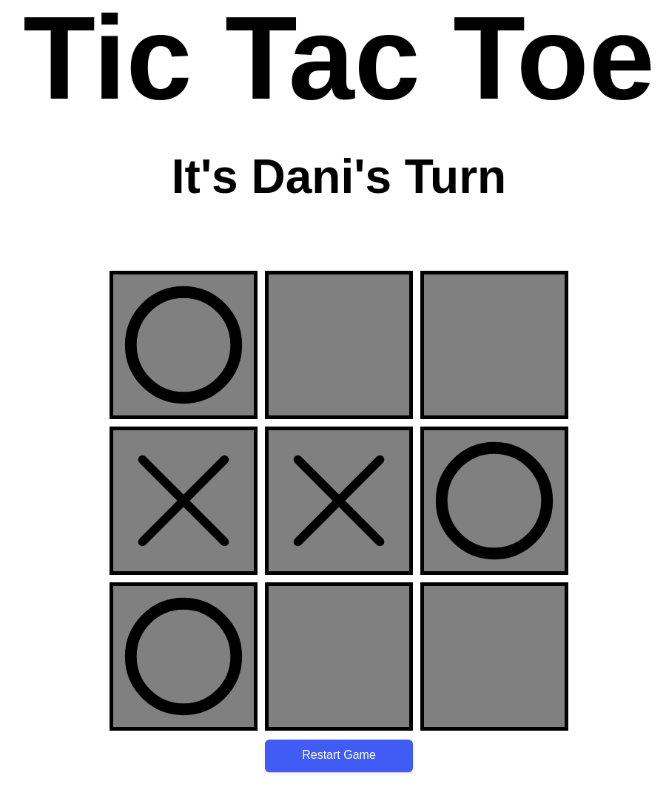

# ❌⭕ TicTacToe

This project is part of **The Odin Project's JavaScript curriculum**, where I built a classic **TicTacToe** game. The project focuses on applying factory functions and module patterns to structure the code and separate game logic from user interface manipulation.

## 🌟 Features

- Play a game of TicTacToe between two players.
- Dynamic game board displayed in the browser.
- The game detects wins, losses, and ties.
- Reset the game board to play again.
- Clear separation between game logic and display.

## 🚀 Technologies Used

- **HTML5**: For the structure of the game board and elements.
- **CSS3**: For styling the game board and visual layout.
- **JavaScript (ES6)**: For the game logic, player handling, and DOM manipulation.

## 📸 Preview

You can view the TicTacToe game here: [Live Demo](https://mrswizzer.github.io/odin-tic-tac-toe)

## 💡 Learning Outcomes

Through this project, I practiced the following skills:

- Implementing **factory functions** and the **module pattern** to organize and encapsulate the code.
- Writing clean and modular **JavaScript** to separate concerns (game logic vs. UI updates).
- Handling user input dynamically through **event listeners**.
- Managing game states, including win, loss, and draw conditions.
- Using **DOM manipulation** to update the visual game board based on player actions.

---

## 🔗 Acknowledgments

This project was built as part of [The Odin Project](https://www.theodinproject.com/)'s curriculum.
